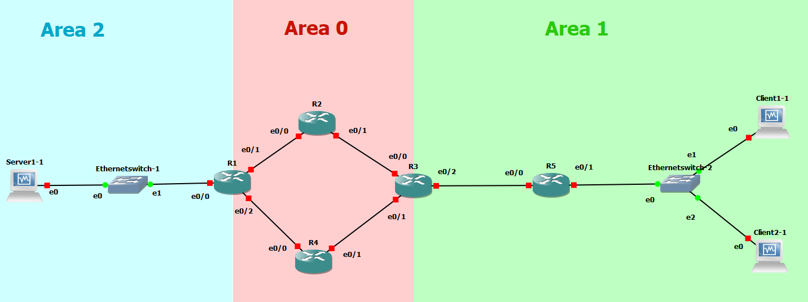

# B1A-tp-6-reseau

Mon gns.



Petit tableau volé comme un flemmard

Réseaux | `area 0` | `area 1` | `area 2` | Commentaire
--- | --- | --- | --- | ---
`10.6.100.0/30` | X | - | - | Liaison entre `r1` et `r2`
`10.6.100.4/30` | X | - | - | Liaison entre `r1` et `r4`
`10.6.100.8/30` | X | - | - | Liaison entre `r2` et `r3` 
`10.6.100.12/30` | X | - | - | Liaison entre `r3` et `r4`
`10.6.101.0/30` | - | X | - | Liaison entre `r3` et `r5`
`10.6.201.0/24` | - | X | - | Réseau des clients
`10.6.202.0/24` | - | - | X | Réseau des serveurs

### Adressage IP de chacune des machines

Machines | `10.6.100.0/30` | `10.6.100.4/30` | `10.6.100.8/30` | `10.6.100.12/30` | `10.6.101.0/30` | `10.6.201.0/24` | `10.6.202.0/24`
--- | --- | --- | --- | --- | --- | --- | --- 
`r1.tp6.b1` | `10.6.100.1` | `10.6.100.5` | - | - | - | - | `10.6.202.254`
`r2.tp6.b1` | `10.6.100.2` | - |  `10.6.100.9` | - | - | - | -
`r3.tp6.b1` | - | - | `10.6.100.10` | `10.6.100.14` | `10.6.101.1` | - | -
`r4.tp6.b1` | - |  `10.6.100.6` | - | `10.6.100.13` | - | - | -
`r5.tp6.b1` | - | - | - | - |  `10.6.101.2` |  `10.6.201.254` | -
`client1.tp6.b1` | - | - | - | - | - |  `10.6.201.10` | -
`client2.tp6.b1` | - | - | - | - | - |  `10.6.201.11` | -
`server1.tp6.b1` | - | - | - | - | - | - | `10.6.202.10`

Les petits traceroutes de la beauté:

Serveur 1:
```
[root@server1 ~]# traceroute client2
traceroute to client2 (10.6.201.11), 30 hops max, 60 byte packets
 1  gateway (10.6.202.254)  10.634 ms  10.550 ms  10.545 ms
 2  10.6.100.2 (10.6.100.2)  20.494 ms  20.440 ms  20.374 ms
 3  10.6.100.10 (10.6.100.10)  41.650 ms  41.614 ms  41.550 ms
 4  10.6.101.2 (10.6.101.2)  61.679 ms  61.633 ms  61.567 ms
 5  client2 (10.6.201.11)  71.237 ms !X  71.194 ms !X  71.175 ms !X
[root@server1 ~]# traceroute client1
traceroute to client1 (10.6.201.10), 30 hops max, 60 byte packets
 1  gateway (10.6.202.254)  2.854 ms  2.721 ms  2.649 ms
 2  10.6.100.6 (10.6.100.6)  24.591 ms  24.610 ms  24.533 ms
 3  10.6.100.14 (10.6.100.14)  44.786 ms  44.747 ms  44.676 ms
 4  10.6.101.2 (10.6.101.2)  65.408 ms  65.394 ms  65.473 ms
 5  client1 (10.6.201.10)  77.607 ms !X  77.614 ms !X  77.558 ms !X
```

Client 1:
```
[root@client1 ~]# traceroute server1
traceroute to server1 (10.6.202.10), 30 hops max, 60 byte packets
 1  gateway (10.6.201.254)  8.317 ms  8.206 ms  8.136 ms
 2  10.6.101.1 (10.6.101.1)  18.699 ms  18.647 ms  18.682 ms
 3  10.6.100.13 (10.6.100.13)  39.497 ms  39.435 ms  39.775 ms
 4  10.6.100.5 (10.6.100.5)  60.513 ms  60.472 ms  60.492 ms
 5  server1 (10.6.202.10)  60.417 ms !X  60.338 ms !X  60.245 ms !X
[root@client1 ~]# traceroute client2
traceroute to client2 (10.6.201.11), 30 hops max, 60 byte packets
 1  client2 (10.6.201.11)  1.153 ms !X  1.053 ms !X  1.152 ms !X
```

Client 2:
```
[root@client2 ~]# traceroute server1
traceroute to server1 (10.6.202.10), 30 hops max, 60 byte packets
 1  gateway (10.6.201.254)  9.656 ms  9.597 ms  9.514 ms
 2  10.6.101.1 (10.6.101.1)  32.498 ms  32.466 ms  32.385 ms
 3  10.6.100.13 (10.6.100.13)  52.868 ms  52.804 ms  52.829 ms
 4  10.6.100.5 (10.6.100.5)  73.870 ms  73.810 ms  73.783 ms
 5  server1 (10.6.202.10)  84.462 ms !X  84.422 ms !X  84.597 ms !X
[root@client2 ~]# traceroute client1
traceroute to client1 (10.6.201.10), 30 hops max, 60 byte packets
 1  client1 (10.6.201.10)  0.665 ms !X  0.783 ms !X  0.694 ms !X
```


# Lab 3 : Let's end this properly


Service | Qui porte le service ? | Pour qui ? | Pourquoi ? 
--- | --- | --- | ---
**NAT** | `r4.tp6.b1` | tout le monde (routeurs & VMs) | Le NAT permet d'accéder à l'extérieur, il permet de sortir du LAN. Toutes les machines peuvent en avoir besoin dans notre petite infra
**Serveur Web** | `server1.tp6.b1` | réseau client `10.6.201.0/24` | Le serveur Web symbolise un service d'infra en interne. Dispo pour nos clients. Plus de détails dans la section dédiée.
**DHCP** | `client2.tp6.b1` | réseau client `10.6.201.0/24` | Le DHCP (qui permet d'attribuer des IPs automatiquement) c'est pour des clients. Pas pour des serveurs. Un serveur, on veut qu'il ait une IP fixe. 
**DNS** | `server1.tp6.b1` | tout le monde (routeurs & VMs) | Le DNS nous permettra de résoudre les noms de domaines en local et nous passer du fichier `/etc/hosts`
**NTP** | `server1.tp6.b1` | réseau serveur `10.6.202.0/24` | Le NTP, qui permet la synchronisation de l'heure, est souvent indispensable pourdes serveurs mais totalement négligeable pour des clients (genre vos PCs, s'ils sont pas à l'heure, tout le monde s'en fout)

**Avec tout ça, on a un petit réseau propre, carré, et (presque) autonome !**

---

## 1. NAT : accès internet

J'ai internet sur R2:
```
router2#telnet trip-hop.net 80
Translating "trip-hop.net"...domain server (8.8.8.8) [OK]
Trying trip-hop.net (213.186.33.4, 80)... Open
GET/
HTTP/1.1 400 Bad Request
Server: squid
Mime-Version: 1.0
Date: Tue, 05 Mar 2019 16:12:35 GMT
Content-Type: text/html;charset=utf-8
Content-Length: 4104
X-Squid-Error: ERR_INVALID_REQ 0
Vary: Accept-Language
Content-Language: fr
X-Cache: MISS from PF1-BOR1FR
X-Cache-Lookup: NONE from PF1-BOR1FR:3128
Connection: close

```

J'ai internet sur mes VM:
```
[root@client1 network-scripts]# dig google.com @8.8.8.8
;; QUESTION SECTION:
;google.com.                    IN      A

;; ANSWER SECTION:
google.com.             287     IN      A       216.58.213.174

;; Query time: 135 msec
;; SERVER: 8.8.8.8#53(8.8.8.8)
;; WHEN: Tue Mar 05 17:08:27 CET 2019
;; MSG SIZE  rcvd: 55
```

## 2. Un service d'infra

Curl depuis le client 1 vers le localhost de server 1:
```
[root@client1 etc]# curl server1
<!DOCTYPE html PUBLIC "-//W3C//DTD XHTML 1.1//EN" "http://www.w3.org/TR/xhtml11/DTD/xhtml11.dtd">

<html xmlns="http://www.w3.org/1999/xhtml" xml:lang="en">
    <head>
        <title>Test Page for the Nginx HTTP Server on Fedora</title>
        <meta http-equiv="Content-Type" content="text/html; charset=UTF-8" />
        <style type="text/css">
            /*<![CDATA[*/
```
Y'a encore plein d'autre ligne, mais bon, c'est long


## 3. Serveur DHCP

Bonjour, je suis la nouvelle adresse IP de client1 avec un nouveau `dhclient -v` et un `ip a` à la suite:

```
[root@client1 network-scripts]# dhclient -v
Internet Systems Consortium DHCP Client 4.2.5
Copyright 2004-2013 Internet Systems Consortium.
All rights reserved.
For info, please visit https://www.isc.org/software/dhcp/

Listening on LPF/enp0s8/08:00:27:9b:9f:67
Sending on   LPF/enp0s8/08:00:27:9b:9f:67
Listening on LPF/enp0s3/08:00:27:be:8b:15
Sending on   LPF/enp0s3/08:00:27:be:8b:15
Sending on   Socket/fallback
DHCPDISCOVER on enp0s8 to 255.255.255.255 port 67 interval 3 (xid=0x4f731e4a)
DHCPDISCOVER on enp0s3 to 255.255.255.255 port 67 interval 7 (xid=0x40d6f405)
DHCPREQUEST on enp0s8 to 255.255.255.255 port 67 (xid=0x4f731e4a)
DHCPOFFER from 192.168.15.2
DHCPACK from 192.168.15.2 (xid=0x4f731e4a)
bound to 192.168.15.5 -- renewal in 535 seconds.
[root@client1 network-scripts]# ip a
1: lo: <LOOPBACK,UP,LOWER_UP> mtu 65536 qdisc noqueue state UNKNOWN group default qlen 1000
    link/loopback 00:00:00:00:00:00 brd 00:00:00:00:00:00
    inet 127.0.0.1/8 scope host lo
       valid_lft forever preferred_lft forever
    inet6 ::1/128 scope host
       valid_lft forever preferred_lft forever
2: enp0s3: <BROADCAST,MULTICAST,UP,LOWER_UP> mtu 1500 qdisc pfifo_fast state UP group default qlen 1000
    link/ether 08:00:27:be:8b:15 brd ff:ff:ff:ff:ff:ff
    inet 10.6.201.50/24 brd 10.6.201.255 scope global noprefixroute dynamic enp0s3
       valid_lft 587sec preferred_lft 587sec
    inet 10.6.201.51/24 brd 10.6.201.255 scope global secondary noprefixroute dynamic enp0s3
       valid_lft 470sec preferred_lft 470sec
    inet6 fe80::a00:27ff:febe:8b15/64 scope link
       valid_lft forever preferred_lft forever
```

## 4. Serveur DNS

Et voila !!!!!!

Le DNS qui fonctionne:
```
[root@server1 ~]# ping client1.tp6.b1
PING client1.tp6.b1 (10.6.201.50) 56(84) bytes of data.
64 bytes from 10.6.201.50 (10.6.201.50): icmp_seq=2 ttl=60 time=77.7 ms
64 bytes from 10.6.201.50 (10.6.201.50): icmp_seq=3 ttl=60 time=85.3 ms
```


et en plus comme tu me l'as indiqué, mon DHCP donner l'adresse du DNS:
```
subnet 10.6.201.0 netmask 255.255.255.0 {
  range 10.6.201.50 10.6.201.70;
  option domain-name "tp6.b1";
  option routers 10.6.201.254;
  option broadcast-address 10.6.201.255;
  option domain-name-servers 10.6.202.10, 8.8.8.8;
}
```

## 5. Serveur NTP

Idem ici, NTP, c'est du service d'infra pour nos serveurs ! Alors ce sera sur `server1.tp6.b1` encore.  

Tout ça serait sur plusieurs machines dans un cas réel. Rien ne vous empêche d'en créer d'autres pour tester si votre machine vous le permet.

### Présentation

NTP (pour *Network Time Protocol*) est le protocole (= la langue) que l'on utilise pour permettr eà plusieurs serveurs d'être synchronisés au niveau de la date et de l'heure. Le problème est loin d'être trivial lorsque l'on s'y intéresse de près.  

Il existe des [serveurs NTP publics](https://www.pool.ntp.org), sur lesquels n'importe qui peut se synchroniser. Ils servent souvent de référence.  

Dans notre cas :
* on va demander à `server1.tp6.b1` de se synchroniser sur un serveur externe
* et on va demander à toutes les autres machines clientes de se synchroniser sur `server1.tp6.b1`

Dernier détail : sur CentOS, le service qui gère NTP s'appelle `chrony` :
* le démon systemd s'appelle `chronyd`
  * donc `sudo systemctl restart chronyd` par exemple
* la commande pour avoir des infos est `chronyc`
  * `chronyc sources` pour voir les serveurs pris en compte par `cronyd`
  * `chronyc tracking` pour voir l'état de la synchronisation
* la configuration se trouve dans `/etc/chrony.conf`
* présent par défaut sur CentOS

### Mise en place

Sur `server1.tp6.b1` : 
* éditer le fichier `/etc/chrony.conf`
  * [un contenu modèle se trouve ici](./chrony/serveur/chrony.conf)
  * choisissez le pool de serveurs français sur [le site des serveurs externes de référence](https://www.pool.ntp.org) et ajoutez le à la configuration
* [ouvrir le port utilisé par NTP](../../cours/procedures.md#interagir-avec-le-firewall)
  * c'est le port 123/UDP
* démarrer le service `chronyd`
  * `sudo systemctl start chronyd`
* vérifier l'état de la synchronisation NTP
  * `chronyc sources`
  * `chronyc tracking`

Sur toutes les autres machines : 
* éditer le fichier `/etc/chrony.conf`
  * [un contenu modèle se trouve ici](./chrony/client/chrony.conf)
* [ouvrir le port utilisé par NTP](../../cours/procedures.md#interagir-avec-le-firewall)
  * c'est le port 123/UDP
* démarrer le service `chronyd`
  * `sudo systemctl start chronyd`
* vérifier l'état de la synchronisation NTP

---

# Bilan

* on a des **clients** 
  * configurés automatiquement dès qu'on les ajoute grâce au serveur DHCP
    * IP 
    * passerelle
    * serveur DNS
  * peuvent joindre internet sans pb avec un navigateur web
  * peuvent joindre le serveur web (NGINX) en interne
* on a des **serveurs**
  * ils sont synchros au niveau de l'heure grâce à NTP
  * ils sont en charge de la résolution de nom locale avec le serveur DNS
  * ils fournissent des services d'infra (symbolisé par notre serveur web NGINX)
* on a des **routeurs**
  * qui mettent en place un routage dynamique (OSPF)
  * qui fournissent un accès WAN (Internet) grâce au NAT

:fire:

# Aller plus loin

Pistes pour aller plus loin (l'ordre n'est pas important), mp si vous voulez + d'infos :
* Serveur Web
  * sécuriser le serveur Web avec le protocole TLS
    * et expliquer un peu la démarche
  * mettre en place un outil pour gérer son site web
    * un bête partage FTP peut faire l'affaire
    * l'utilisateur se connecte pour déposer ses jolies pages html :)
* Serveurs SSH
  * sécuriser le(s) serveur(s) SSH avec une authentification par échange de clés
* DNS
  * créer un *slave* DNS
    * le serveur qu'on a là c'est un *master*
  * mettre en place une interface graphique pour gérer le DNS
    * parce que les fichiers de zone c'est quand même super chiant écrire/modifier
* Switch
  * remplacer les switches pourris de GNS par des switch cisco et mettre en place des VLANs
    * vous pouvez utilisez des IOU L2 pour ça, demandez moi pour + d'infos
* Routeurs
  * mettre en place une authentification MD5 pour OSPF
  * utiliser LACP pour agréger deux interfaces réseau 
    * tolérance de panne (si un câble lâche, on est toujours bon)
    * débit plus haut, nombre de connexions simultanées augmenté
      * attention avec ça, c'est pas aussi bête que doubler le débit, nan nan. Mp pour + d'infos